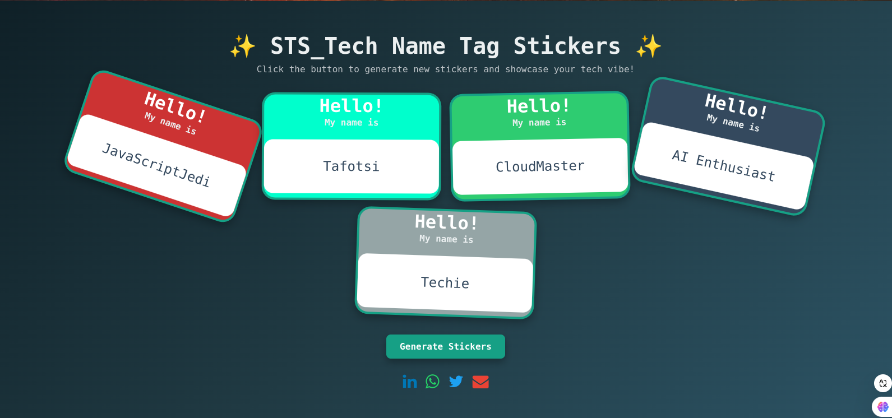

# **✨ STS_Tech Name Tag Stickers**

An interactive and visually engaging project to showcase randomly generated name tag stickers inspired by the tech and development world. This fun and customizable tool is perfect for events, coding communities, or just having some creative fun!

---

## **🚀 Features**

- 🎨 **Dynamic Sticker Generation**: Generate name stickers dynamically with vibrant tech-inspired colors and random rotations.
- 🖼️ **Interactive Design**: Stickers animate on hover, with smooth transitions and a polished "pop-in" effect.
- 📱 **Responsive Layout**: Stickers are displayed in a responsive grid, adapting to various screen sizes.
- 🖋️ **Customizable**: Easily update names, colors, or styles to match your needs.
- ⚡ **Tech Vibes**: Clean, modern design with a monospace font and a color palette inspired by the tech world.

---

## **📂 Project Structure**

```
├── index.html        # Main HTML file
├── assets/
│   ├── style.css     # Custom styles
│   └── script.js      # Interactive functionality
└── README.md         # Project documentation
```

---

## **🔧 How to Use**

1. Clone the repository or download the files:
   ```bash
   git clone https://github.com/Dimitri-Tedom/STS_NameTagSticker.git
   ```
2. Open the project folder:
   ```bash
   cd STS_NameTagSticker
   ```
3. Open `index.html` in your favorite browser.

---

## **📜 Customization**

### Update Names:
Modify the `names` array in `script.js` to add or change the list of names.

```javascript
const names = ["Dimitri", "Tafotsi", "SnowDev", "CodeNinja", "BugFixer", "Techie"];
```

### Update Colors:
Change the `colors` array in `script.js` to customize the palette.

```javascript
const colors = ["#2ecc71", "#3498db", "#9b59b6", "#e74c3c", "#f1c40f"];
```

### Style Tweaks:
Update `style.css` to adjust animations, layouts, or fonts.

---

## **🎥 Demo**

Include a link to a live demo or screenshot if possible:



---

## **🌟 Features to Explore**

- Add user input to dynamically enter names.
- Integrate local storage to save and reload sticker configurations.
- Add random fonts or stickers for extra personalization.
- Generate downloadable images for each sticker.

---

## **🤝 Contributing**

Contributions are welcome! Feel free to fork the project and submit pull requests.

---


## **🙌 Acknowledgements**

- Design inspired by modern tech vibes.
- Fonts used: [JetBrains Mono](https://fonts.google.com/specimen/JetBrains+Mono).
- Colors inspired by [Flat UI Colors](https://flatuicolors.com/).

---

## **📬 Contact**

For any questions or suggestions, feel free to reach out at:  
📧 wilfried.tedom@facsciences-uy1.cm  
🔗 [GitHub Profile](https://github.com/tedom-tafotsi-dimitri-wilfried)

--- 
